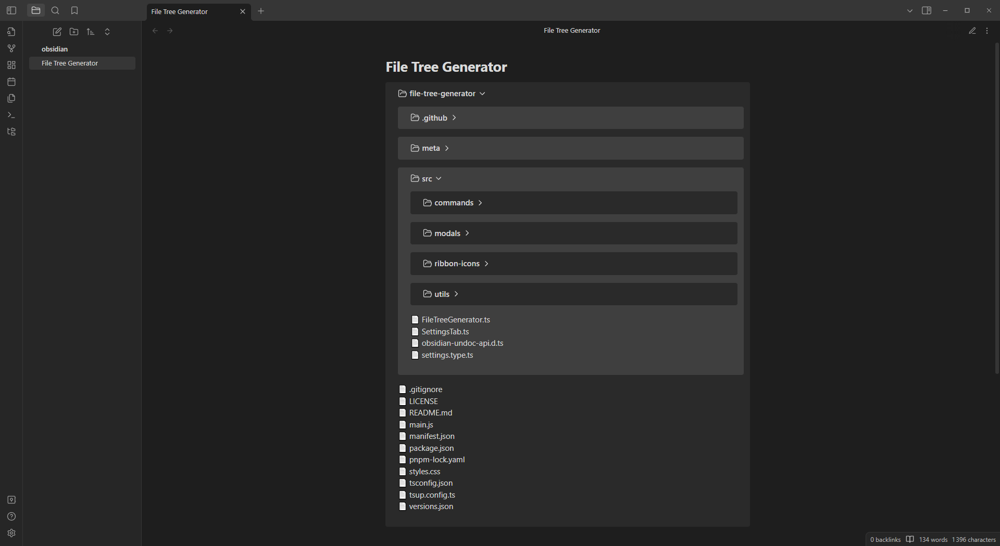
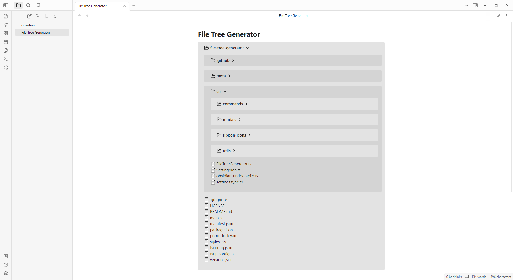
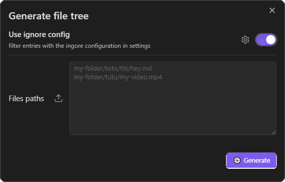

# File Tree Generator
An Obsidian plugin allow you to generate file trees using [Obsidian Callouts](https://help.obsidian.md/Editing+and+formatting/Callouts)!

## How to use?
When editing an Obsidian note, you can use `generate file tree` command or use the generate file tree Ribbon Icon. 

> [!NOTE]
> if you are on desktop, you can import a folder by pressing the extra button next to your files paths input

---

As you see, you can ignore patterns of files/folders in the setting tabs. 
This patterns follow the [gitignore spec 2.22.1](https://git-scm.com/docs/gitignore/2.22.1)

## Note
This plugin use FS *(desktop only)* to load files from your local directory.

## Installation
In your vault folder, go to `./.obsidian/plugins/file-tree-generator/`
Then you can:

Clone this REPO and run `npm run build` or directly download latest plugin release containing `main.js`, `manifest.json` and `styles.css`.

> [!NOTE]
> If you are a developer, clone this repo -> run `npm i` -> start coding with `npm run dev` *(to hot-reload the plugin in obsidian, install [Hot-Reload plugin](https://github.com/pjeby/hot-reload))*